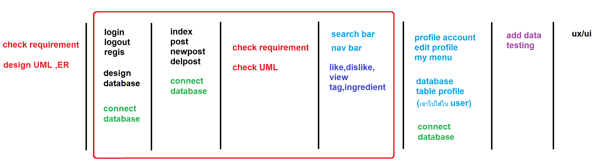

**Work Flow**
===============
## Project food community webboard 
<br>

### **Member :**

1. *[พันธกร    แสงจินดา](https://www.facebook.com/gotkunglovely)* ( UX/UI , Programmer )

2. *[พีรวิชญ์    อนันต์สุขธรรม](https://www.facebook.com/p.perawit)* ( Project Manager , Programmer )

3. *[ธณชาติ    ประเสริฐสุข](https://www.facebook.com/moss.pra)* ( Tester , UX/UI )

4. *[จิรเมธ    แก้วคำ](https://www.facebook.com/bomcrmon)* ( Main Programmer )

5. *[พิมพ์พลอย  ผึ่งนิล](https://www.facebook.com/pimploy.pungnin)* ( Data Analysis , Tester)

```bash
โปรเจคนี้เป็นส่วนหนึ่งของวิชา Software Engineering

โดยใช้ภาษา
# HTML
# CSS
# PHP
# JavaScript
# SQL
```
#

#
## phase 0
- เก็บ requirement

- design UML


#
## phase 1
- ก๊อต (รองาน)

- พี (verify)

- มอส (login , logout) 

- บอม (register , register_save)     

- โม (design database)

design database , connect database , testing

#
## phase 2
- ก๊อต (index (ย้ายมาช่วยมอสกับบอม)) 

- พี (verify,register,register_save,login,logout connect database)

- มอส (post,post_save,newpost,newpost_save,แสดง comment ใน post)

- บอม (post,post_save,newpost,newpost_save,แสดง comment ใน post)

- โม (แก้ database ใหม่ (ย้ายมาช่วยพี))

index , post , newpost , newpost_save connect database

แสดง comment ใน post (don't forget user role!!!) 

check requirement , diagram ก่อนเริ่ม phase ใหม่

เก็บงาน แก้วิธี connect database และ testing ก่อนเริ่ม phase ใหม่

#
### phase 3.1
- ก๊อต (พักอ่าน cal รอประชุม) 

- พี (ย้ายไปทำ mobile and cloud)

- มอส (เก็บงาน database และ หน้า post , index)

- บอม (ศึกษาการเพิ่มข้อมูลแบบ array)

- โม (ศึกษาการเพิ่มข้อมูลแบบ array)

### phase 3.2
- ก๊อต (รอประชุม) 

- พี (รอประชุม)

- มอส (รอประชุม)

- บอม (รอประชุม)

- โม (รอประชุม)

กลับมา check requirement และ UML

พูดคุยปัญหาที่เจอและแนวทางแก้ไขปัญหา

จัดตารางการทำงานใหม่ ให้มีเวลาเตรียมตัวอ่านหนังสือสอบ

#
## phase 4
- ก๊อต (สอบวิชาตกค้าง)

- พี (search bar , nav bar)

- มอส (like , dislike ,view) 

- บอม (ingredient , tag)     

- โม (สอบวิชาตกค้าง)

พูดคุยปัญหาที่เจอและแนวทางแก้ไขปัญหา

แบ่งงานกันแทนคนที่ไม่สามารถทำงานช่วงนี้ได้

#
## phase 5
- ก๊อต (สอบวิชาตกค้าง)

- พี (profile , edit_profile , myprofile , mymenu)

- มอส (connect and fix database) 

- บอม (ย้ายไปทำ mobile and cloud)     

- โม (สอบวิชาตกค้าง)

#
## phase 6
- ก๊อต (UX/UI)

- พี (testing)

- มอส (testing) 

- บอม (testing)     

- โม (เอกสาร)

testing ระบบ และพูดคุยปัญหา

list รายการปัญหาที่เจอและไล่แก้ไข

#
## phase 7
- ก๊อต (UX/UI)

- พี (testing) 

- มอส (UX/UI)

- บอม (UX/UI)   

- โม (เอกสาร)

เตรียมส่งานและซ้อมพรีเซน ;)

#